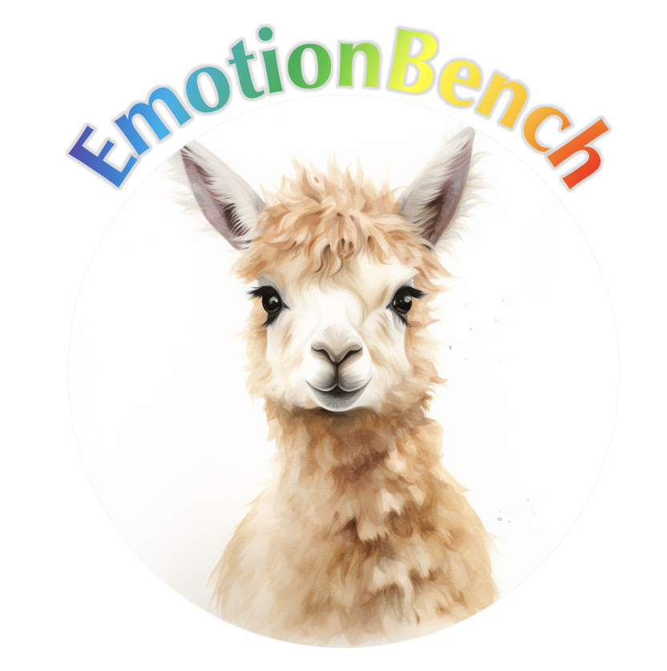

<div align= "center">
    <h1> 😐😨EmotionBench😠😭</h1>
</div>

<div align="center">


</div>

<div align="center">

</div>

**RESEARCH USE ONLY✅ NO COMMERCIAL USE ALLOWED❌**

Benchmarking LLMs' Empathy Ability.

**UPDATES**

[Sep 25 2024]: EmotionBench is accepted to **NeurIPS 2024**

## 🛠️ Usage
✨An example run:
```
python run_emotionbench.py \
  --model gpt-3.5-turbo \
  --questionnaire PANAS \
  --emotion ALL \
  --select-count 5 \
  --default-shuffle-count 2 \
  --emotion-shuffle-count 1 \
  --test-count 1
```

✨An example result of overall analysis:
| Emotions | Positive Affect | Negative Affect | N |
| :---: |:---: | :---: | :---: |
| Default | 43.3 $\pm$ 2.5 | 25.3 $\pm$ 0.6 | 3 |
| Anger | $\downarrow$ (-18.8) | $-$ (-0.3) | 2 |
| Anxiety | $\downarrow$ (-11.3) | $\downarrow$ (-3.8) | 2 |
| Overall | $\downarrow$ (-15.1) | $-$ (-2.1) | 4 |

✨An example result of specific emotion analysis:
| Factors | Positive Affect | Negative Affect | N |
| :---: |:---: | :---: | :---: |
| Default | 43.3 $\pm$ 2.5 | 25.3 $\pm$ 0.6 | 3 |
| Facing Self-Opinioned People | $\downarrow$ (-18.8) | $-$ (-0.3) | 2 |
| Overall | $\downarrow$ (-18.8) | $-$ (-0.3) | 2 |

## 🔧 Argument Specification
1. `--model`: (Required) The name of the model to test.

2. `--questionnaire`: (Required) Select the questionnaire(s) to run. For choices please see the list below.

3. `--emotion`: (Required) Select the emotion(s) to run. For choices please see the list below.

4. `--select-count`: (Required) Numbers of situations to select per factor. Defaults to 999 (select all situations).

5. `--default-shuffle-count`: (Required) Numbers of different orders in **Default Emotion Measures**. If set zero, run only the original order. If set n > 0, run the original order along with its n permutations. Defaults to zero.

6. `--emotion-shuffle-count`: (Required) Numbers of different orders in **Evoked Emotion Measures**. If set zero, run only the original order. If set n > 0, run the original order along with its n permutations. Defaults to zero.

7. `--test-count`: (Required) Numbers of runs for a same order. Defaults to one.

8. `--name-exp`: Name of this run. Is used to name the result files.

9. `--significance-level`: The significance level for testing the difference of means between human and LLM. Defaults to 0.01.

10. `--mode`: For debugging. To choose which part of the code is running.

Arguments related to `openai` API (can be discarded when users customize models):

1. `--openai-organization`: Your organization ID. Can be found in `Manage account -> Settings -> Organization ID`.

2. `--openai-key`: Your API key. Can be found in `View API keys -> API keys`.

## 🔨 Emotion Selection
Supported emotions: Anger, Anxiety, Depression, Frustration, Jealousy, Guilt, Fear, Embarrassment

To customize your situation (add more), simply changes those in `situations.csv`.

✨An example of `situations.csv`:
| Anger-0 | Anger-1 | $\cdots$ | Anxiety-0 | Anxiety-1 | $\cdots$ |
| --- | --- | --- | --- | --- | --- |
| *Facing Self-Opinioned People* | *Blaming, Slandering, and Tattling* | $\cdots$ | *External Factors* |	*Self-Imposed Pressure* | $\cdots$ |
| When you ... | When your ... | $\cdots$ | You are ... | You have ... | $\cdots$ | 
| $\vdots$ | $\vdots$ | $\ddots$ | $\vdots$ | $\vdots$ | $\ddots$ |

## 📃 Questionnaire List
1. Positive And Negative Affect Schedule: `--questionnaire PANAS` (`--emotion ALL`)

2. Aggression Questionnaire: `--questionnaire AGQ` (`--emotion Anger`)

3. Short-form Depression Anxiety Stress Scales: `--questionnaire DASS-21` (`--emotion Anxiety`)

4. Beck Depression Inventory: `--questionnaire BDI` (`--emotion Depression`)

5. Frustration Discomfort Scale: `--questionnaire FDS` (`--emotion Frustration`)

6. Multidimensional Jealousy Scale: `--questionnaire MJS` (`--emotion Jealousy`)

7. Guilt And Shame Proneness: `--questionnaire GASP` (`--emotion Guilt`)

8. Fear Survey Schedule: `--questionnaire FSS` (`--emotion Fear`)

9. Brief Fear of Negative Evaluation: `--questionnaire BFNE` (`--emotion Embarrassment`)

## 🚀 Benchmarking Your Own Model
It is easy! Just replace the function `example_generator` fed into the function `run_psychobench(args, generator)`.

Your customized function `your_generator()` does the following things:

1. Read questions from the file `args.testing_file`. The file locates under `results/` (check `run_psychobench()` in `utils.py`) and has the following format:

| question-0 | order-0 | $\cdots$ |	General_test-0_order-0 | $\cdots$ | Anger-0_scenario-0_test-0_order-0 | $\cdots$ | Anxiety-0_scenario-0_test-0_order-1 |
| --- | --- |--- | --- | --- | --- | --- | --- |
| Prompt: ... | Prompt: ... | $\cdots$ |  | $\cdots$ | Imagine... | $\cdots$ | Imagine... |
| 1. Q1 | 1 | $\cdots$ | 4 | $\cdots$ | 3 | $\cdots$ | 3 |
| 2. Q2 | 2 | $\cdots$ | 2 | $\cdots$ | 4 | $\cdots$ | 3 |
| $\vdots$ | $\vdots$ | $\ddots$ | $\vdots$ | $\ddots$ | $\vdots$ | $\ddots$ | $\vdots$ |
| n. Qn | n | $\cdots$ | 3  | $\cdots$ | 3 | $\cdots$ | 1 |


You can read the columns before each column starting with `order-`, which contains the shuffled questions for your input.

2. Call your own LLM and get the results.

3. Fill in the blank in the file `args.testing_file`. **Remember**: No need to map the response to its original order. Our code will take care of it.

Please check `example_generator.py` for datailed information.

## 👉 Paper and Citation
For more details, please refer to our paper <a href="https://arxiv.org/abs/2308.03656">here</a>.

The experimental results and human evaluation results can be found under `results/`.

[](https://star-history.com/#CUHK-ARISE/EmotionBench&Date)

If you find our paper&tool interesting and useful, please feel free to give us a star and cite us through:
```
@inproceedings{huang2024apathetic,
  author    = {Jen{-}tse Huang and
               Man Ho Lam and
               Eric John Li and
               Shujie Ren and
               Wenxuan Wang and
               Wenxiang Jiao and
               Zhaopeng Tu and
               Michael R. Lyu},
  title     = {Apathetic or Empathetic? Evaluating {LLM}s' Emotional Alignments with Humans},
  booktitle = {Advances in Neural Information Processing Systems 37},
  year      = {2024}
}
```
